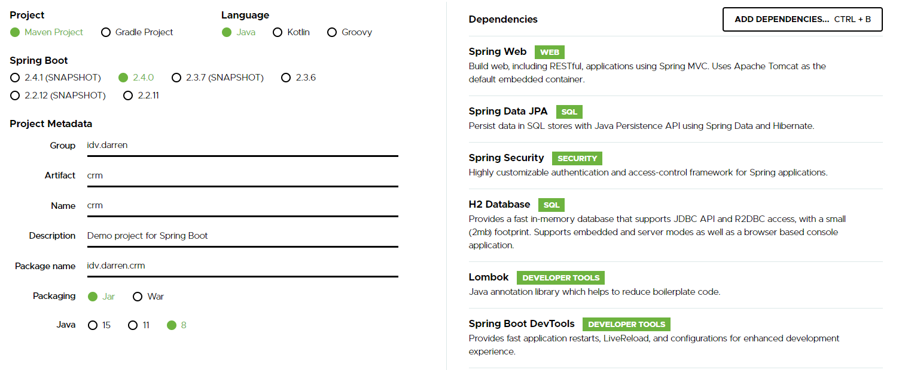

- [CRM](#crm)
  * [使用技術](#tech)
  * [功能實作](#implements)

# CRM
這是一個簡單的 CRM (API only) project
提供訪問 Company 及 Client 資料的 API
進行身份驗證及角色權限控管
及自動化測試

* * *

## 使用技術<a name="tech"/>

- Spring Boot
- Spring Web
- Spring Data JPA
- Spring Security
- Maven
- H2 database
- Lombok
- Swagger

## 功能實作<a name="implements"/>

- 使用 [Spring initializr](https://start.spring.io/) 創建 Spring Boot 專案
  
- 建立 controller 接收 request 及回傳 response
- 建立與資料庫對應的 entity
- 使用 Spring Data JPA 與資料庫溝通
  - 建立 interface 並繼承 JpaRepository
  - 泛型的第一個參數為與資料庫對應的 entity
  - 泛型的第二個參數為 primary key 的資料型態
- 在 Service 層實作業務邏輯並與資料庫交換
- 使用 Spring Security 進行身份驗證及權限控管
  - 定義需要驗證的 URL
  - 定義哪些角色有權限訪問 API
  - 使用 Spring Data Auditor 功能，記錄使用者及操作時間
- 使用 MockMvc 實現自動化測試
  - @WithMockUser 模擬不同使用者訪問 API
  - 測試是否有權限訪問
  - 測試是否返回期待的數據
- 整合 swagger
  - 在 pom.xml 加上 springfox-swagger2 及 springfox-swagger-ui 依賴
  - 配置 Swagger config 檔
  - 訪問 http://localhost:8080/swagger-ui.html 查看 API 文件

